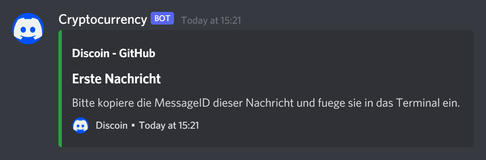

    </img> 
    </img> 
    Ein PHP-Skript um einen Kryptowährungspreis 
    in Discord darzustellen.

--------------------------
 

# Installation für Windows 10
Die Installation des Discoin Webhooks ist sehr einfach, wenn man diese Schritte befolgt
  

## Voraussetzungen
- [Docker] vollständig installiert
- [Discord] und einen [Webhook]
- [Rapid API] Key
  

## Ablauf
### Docker Container
Nach dem Download und entzippen muss man den Docker-Container ausführen installieren und starten.  Dazu öffnest du eine Konsole/Terminal deine Wahl.Navigiere dann in den Projektordner und gib folgenden Befehl ein:

    docker-compose -f "docker-compose.yml" up -d --build
Die Installation sollte automatisch beginnen.

Wenn die Installation erfolgreich abgeschossen wurde, kannst du im Terminal diesen Befehl eingeben:

    docker exec -it phpdev /bin/bash

Du solltest dann im code Ordner `/opt/code` in der Linux Bash landen. Zuletzt musst du nur noch

    php index.php

eingeben.
  

### Setup Discoin Webhook
Wenn das `index.php` gestartet wurde und die Datei `.env` noch nicht existiert, wird nach folgenden Fragen gefragt.

> Bitte gib die Webhook URL ein:
`https://discord.com/api/webhooks/XXXXXXXXXXXXX/XXXXXXXXXXXXXXXXX`

Hier bitten wir dich die URL des Discord [Webhook]s einzugeben.

Hoffentlich hast du bereits im Voraus deinen [Rapid API] Key generieren lassen und diesen bereits kopiert. Er sollte bei der nächsten Frage eingegeben werden, um Abfragen des Bitcoin Wertes zu machen.

> Bitte gib den Rapid-API Key ein:
`XXXXXXXXXXXXXXXXXXXXXXXXXXXXXXXXXXXXXXXXXXXXXXXXXX`

Wenn du den Webhook noch nie Konfiguriert hast für einen Channel, musst du (falls vorhanden) die generierte `.env` Datei löschen und das Skript erneut ausführen. So werden alle fragen erneut gefragt. Wichtig ist dabei diese Frage:

> Wie lautet die MessageID der gesendeten Nachricht?:
`XXXXXXXXXXXXXXXXXX`

Um die ID herauszufinden musst du den [Developer Mode] auf Discord aktiviert haben. Dann klickst du rechts, neben der Nachricht auf die Punkte und wählst `Copy ID` aus. Die ID wird dir dann direkt in das Clipboard gespeichert und du kannst mit Rechtsklick diesen in die Konsole einfügen.
  

### Währungen
Um die normale Währung zu ändern musst du nach dem Setup den Webhook mit <kbd>CTRL</kbd> + <kbd>C</kbd> stoppen und in `.env` die Werte dazu anpassen. Dort gelten die [ISO-4217] Währungskürzel. Für die Cryptowährungen gelten die bekanntesten. Leider gibt es hierfür keine Liste.

 

Nun sollte der Webhook im Hintergrund die Nachricht solange aktualisieren, wie das Terminal offen bleibt.

**Viel Spass**
  

# Informationen zum Projekt
## Projektidee mit Zusammenfassung

Dies ist das Projekt der Kalenderwoche 41 im ZLI in Zürich. Der Auftrag ist es etwas mit einer API zu machen und im Team zu arbeiten.

Unsere Projektidee ist einen Webhook auf Discord in einem Server zu erstellen, der alle paar Sekunden von der [Coinbase API] den bevorzugten Cryptowährungspreis (zum Beispiel [Bitcoin]) abruft und ausgibt. Der Webhook schickt bei der Ausführung einmal eine Nachricht mit einem sogennanten Discord Embed, das den aktuellen Preis mit eventuell einem Verlauf anzeigt. Der Preis sollte dann automatisch, solange die PHP Session bestehen bleibt, jede 1-2 Minuten aktualisiert werden (indem die Nachricht editiert wird).  

## APIs

Wir möchten die [Discord Webhook] API für unser Projekt benutzen, die sehr gut dokumentiert und nicht all zu leicht ist. Dort können wir unsere Applikation ([Coinbase API]) mit Discord verknüpfen.

Um den zurzeitigen Preis der Währung zu bekommen wollten wir zuerst die [Coinbase API] benutzen, jedoch brauchte man dafür einen Token, der man nur mit einer gültigen ID bekommt, wenn man über 18 Jahre alt ist. Marc suchte dann kurz nach einer neuen. Die neue heisst [Rapid API] (funktioniert mit [Twelvedata]) und hat eine maximale Requestrate von 800/Tag, was ausreicht.
  

## Docker Container

Um PHP einfacher benutzen zu können benutzen wir den [Container] von [foxfabi]. So ist nachher, wenn man das Projekt herunterlädt, gleich alles funktionstüchtig und auf der neusten Version ist.  

## SMART Ziele
- Funktionierende Discord Webhook Applikation mit PHP das Nachrichten in einem Channel sendet und diese mit verschiedenen Intervals editiert bis Ende Woche erarbeiten.
- Die Coinbase API mit der Discord Webhook Applikation verknüpfen.
- Verstehen der Discord Webhook API.
- Das Scrum Model anwenden.
- Einen guten Teamgeist und Teamarbeit haben.
  

## Teammitglieder und User Stories

- <strong>Noah Geeler (API-1)</strong>
    - Als Entwickler dieses Projektes möchte ich ein funktionsfähiges Programm mit integrierten APIs erstellen.
    - Als Benutzer der Applikation möchte ich eine möglichst einfache Installation haben.
    - Als Betrachter des Projektes will ich eine gute Übersicht und Navigation besitzen.
- <strong>Marc Willhelm (API-1)</strong>
    - Als Entwickler möchte ich ein möglichst "cleanes", vertsändliches Produkt abliefern, damit es jeder verstehen kann.
    - Als Benutzer möchte ich mühelos Updates über den Cryptomarkt haben, damit ich immer auf dem neusten Stand bleibe.
  

## Team Kodex
1. Ehrlichkeit hat hier oberste Priorität.
2. Man steht zu seinen Fehlern.
3. Sauber und sorgfältig arbeiten.
4. Spass haben.
5. Oft COMMITTEN.

[Coinbase API]: https://developers.coinbase.com/
[Discord Webhook]: https://discord.com/developers/docs/resources/webhook
[Bitcoin]: https://www.google.com/search?q=bitcoin&rlz=1C1YTUH_enCH962CH963&oq=bitcoin+&aqs=chrome.0.69i59l4j0i131i433i512l2j69i61l2.2181j1j7&sourceid=chrome&ie=UTF-8
[foxfabi]: https://github.com/foxfabi
[Container]: https://github.com/foxfabi/phpDEV
[Rapid API]: https://rapidapi.com/twelvedata/api/twelve-data1/pricing
[Twelvedata]: https://twelvedata.com/
[Docker]: https://docs.docker.com/desktop/windows/install/
[Discord]: https://discord.com/
[Webhook]: https://support.discord.com/hc/de/articles/228383668-Einleitung-in-Webhooks
[Developer Mode]: https://www.howtogeek.com/714348/how-to-enable-or-disable-developer-mode-on-discord/
[ISO-4217]: https://de.wikipedia.org/wiki/ISO_4217